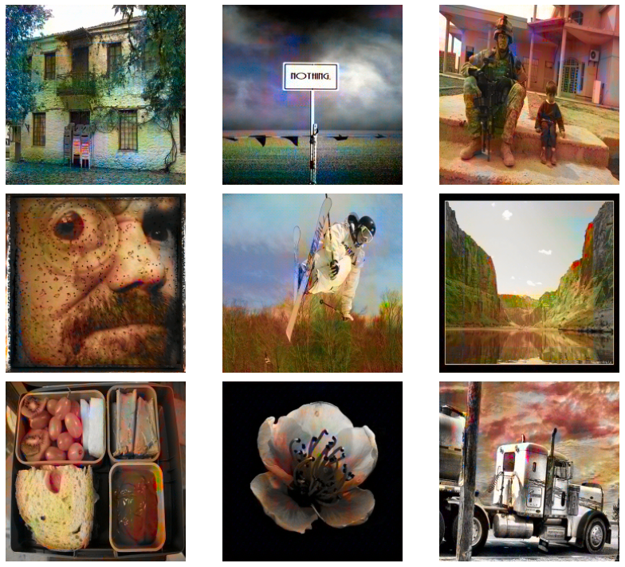

# Flask API to colorize grayscale images
In this work, we present a Flask API intended to colorize images.
The API is deployed here: https://colorization2.herokuapp.com/
It allows to upload and colorize a gray image.
The image is automacally resized (224 per 224).
The html and css code used are adapted from https://github.com/gxercavins/image-api.

# Image Colorization with Generative Adversarial Networks 
The model used to colorize image is a Wasserstein GAN with gradient penalty. 
The training has been done with google colaboratory. The script used to train is here: https://colab.research.google.com/drive/1H0EZVBBklx7M6S6y2L1kl_nBoyLJscFL?usp=sharing

## Dataset
The dataset used for training can be found here : https://www.kaggle.com/shravankumar9892/colorization-dataset
This dataset contains 4 files with the LAB representation of 30000 color images.
The file gray_scale.npy contains 30000 gray_scale images (L channel in range [0,255]). Three other files (ab1.npy, ab2.npy, ab3.npy) contain the A and B channels associated with the gray images from gray_scale.npy.
We used 29000 images for training, the 1000 ther ones can be used for testing the model.

## Networks Architecture
The generator architecture is inspired by: https://github.com/jmt0221/ColorGan/blob/master/ColorGAN.ipynb 
In our case the generator output a LAB image. The generator learns to produce the AB channels and outputs a LAB images (we output the concatenation of the L input with the learned AB channels). The idea is that this way the critic is trained with a LAB image but the generator does not have to learn how to recreate the L channel.
For the critic, we use an autoencoder architecture with no batchnormalization.
  
## Results
Below we show 9 gray images Colorized with the WGAN. The gray images are from the test dataset.

  
  

## References
I.Gulrajani, F.Ahmed,M.Arjovsky, V.Dumoulin and A.Courville, "Improved Training of Wasserstein GANs" Proc.NIPS 2017,pp.5769-5779(2017)
https://arxiv.org/pdf/1704.00028.pdf

The code used in the training loop and in the function that defines the WGAN-gp is taken from this notebook: https://www.kaggle.com/amanooo/wgan-gp-keras

Network architecture inspired by: https://github.com/jmt0221/ColorGan/blob/master/ColorGAN.ipynb

The dataset we use can we found here : https://www.kaggle.com/shravankumar9892/colorization-dataset It contains 30000 images (gray images and LAB images).

Code used to implement the API: https://github.com/gxercavins/image-api

